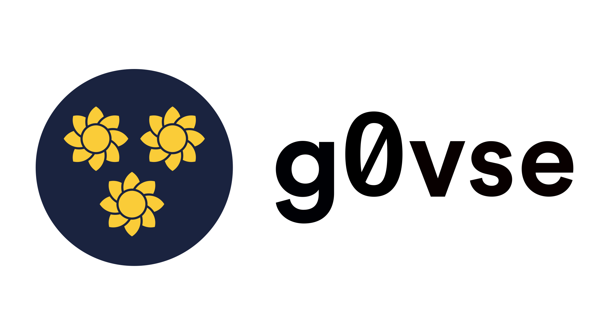

# g0vse



g0vse is a project aiming to make the information available on the Swedish government's website ([regeringen.se](https://www.regeringen.se)) more accessible.

For now, it just fetches the list of pages on the website using the private API and converts that list into JSON. In the near future, it will also provide more metadata and links to attached documents.

## Why g0vse

After the Sunflower revolution in Taiwan, [digital activists created g0v](https://www.taiwan-panorama.com/en/Articles/Details?Guid=736828dd-9df4-48fe-9383-71a5353cf4b7&CatId=7&postname=Pioneers%20of%20Open%20Government%3A%20g0v%27s%20Civic%20Hackers) (pronounced "gov-zero") and the motto "[fork the government](https://www.wired.com/story/taiwan-sunflower-revolution-audrey-tang-g0v/)". In order to improve the government's poorly designed digital services, they developed better and more transparent alternatives and hosted them on the g0v.tw domain. To switch from the official websites (ending in gov.tw) to the grassroot alternatives (ending in g0v.tw), citizens only had to change a letter in the site URL.

In Sweden, the situation we face is similar. Despite some efforts, the government is struggling to go from reactive transparency (the analog and very much paper-based *offentlighetsprincipen*) to proactive transparency and open data. The government's chancellery (*Regeringskansliet*) is a clear example of that, they publish a lot of very important information on [regeringen.se](https://www.regeringen.se) (reports, investigations, bills...) but it is not accessible through APIs, forcing civil society, journalists and even government agencies to resort to a lot of manual work in order to access the data. Some have built web scrapers to download the data automatically but these are hard to implement and unreliable.

The goal with g0vse is to build a performant scraper that will make the data accessible for everyone else to reuse. It will hopefully become a collectively maintained project so it is more resilient in case of changes on the source website. Furthermore, it will fetch data in a respectful way without putting pressure on the website. It should eventually reduce the pressure by removing the need for others to scrape on their end.

The hope of this project is that it won't be needed once the government's website becomes modern and provides open data for its content. Unfortunately, the past years have shown very little sign of that happening in the near future.

## Where's the data?

The data is made available through three static APIs:

- [/api/items.json](https://github.com/PierreMesure/g0vse/raw/master/api/items.json), a complete list of the pages fetched from the website
- [/api/codes.json](https://github.com/PierreMesure/g0vse/raw/master/api/codes.json), a list of codes used to understand the content of the page and its sender
- [/api/latest_updated.json](https://github.com/PierreMesure/g0vse/raw/master/api/latest_updated.json), some info about the number of items and when the data was last updated

License is CC0 for the last two files, but it's unclear for the first one as Sweden doesn't have a modern law for access to public information where a default license could be specified and the government chancellery hasn't provided one either. In practice, it's safe to reuse.

## What if I want to reuse this code?

Go ahead! You'll need Python 3 and to install dependencies using:

```bash
pip install -r requirements.txt
```

After that, you can fetch the latext 20 items and associated codes:

```python
from services.downloader import Downloader

items, codes = downloader.get_latest_items(20)
```

Have a look at [fetch.py](./fetch.py) for a more complex logic that can download all articles or just the missing ones.

## License

The code is licensed under AGPLv3.
